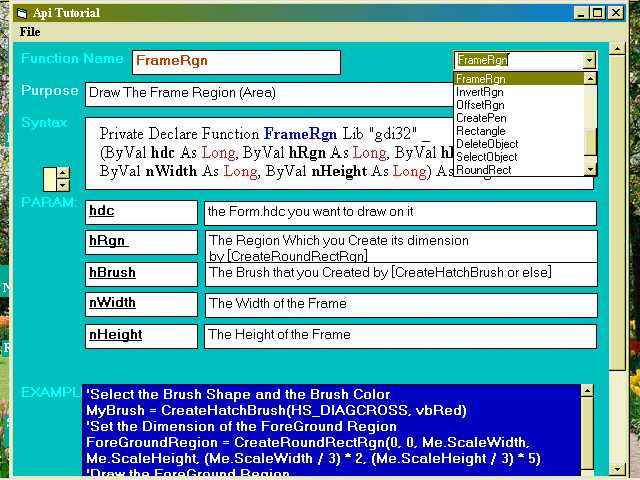



## API Dictionary Ver 1\.2

### Description

Show Api Functions in a Friendly User Interface

Api Function Name - Syntax - its Purpose - Parameters - their meaning - Example All in one

Form enable you to add more functions to the database
 
### More Info
 

             |
---                |---
**Submitted On**   |2007-05-28 08:31:46
**By**             |[Waguih Youssef Sami](https://github.com/Planet-Source-Code/PSCIndex/blob/master/ByAuthor/waguih-youssef-sami.md)
**Level**          |Intermediate
**User Rating**    |4.5 (18 globes from 4 users)
**Compatibility**  |VB 5\.0, VB 6\.0
**Category**       |[Complete Applications](https://github.com/Planet-Source-Code/PSCIndex/blob/master/ByCategory/complete-applications__1-27.md)
**World**          |[Visual Basic](https://github.com/Planet-Source-Code/PSCIndex/blob/master/ByWorld/visual-basic.md)
**Archive File**   |[API\_Dictio2067835282007\.zip](https://github.com/Planet-Source-Code/waguih-youssef-sami-api-dictionary-ver-1-2__1-68683/archive/master.zip)

